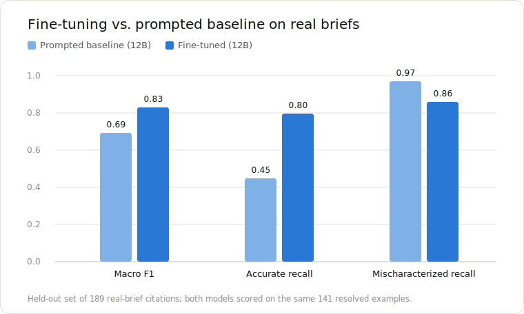
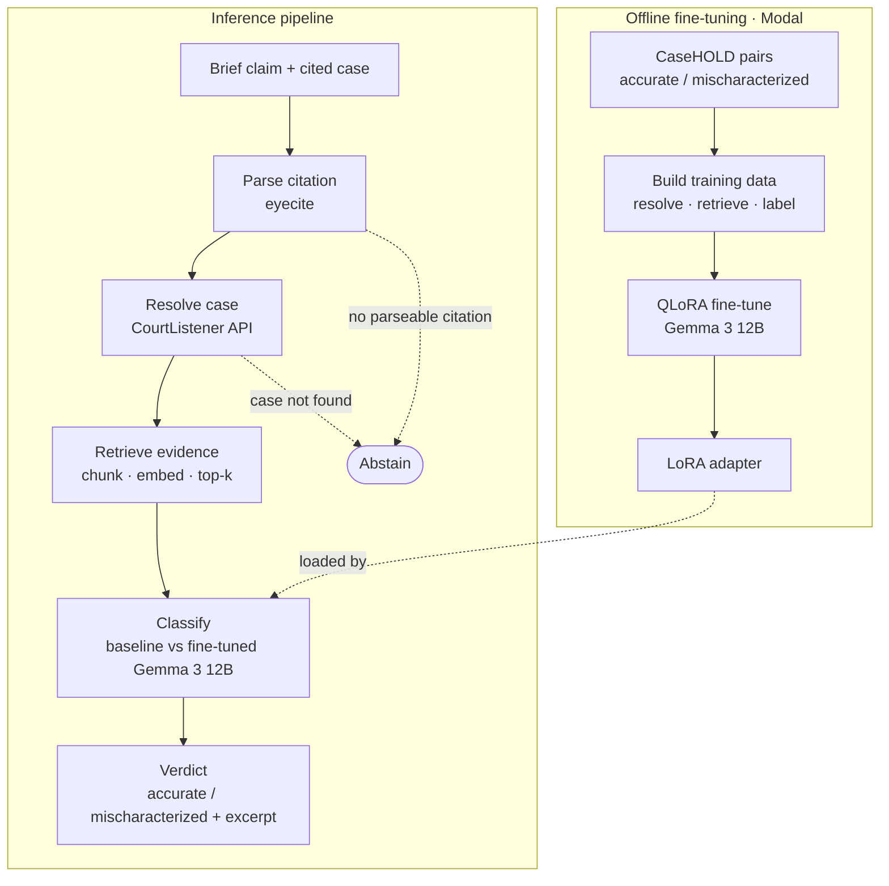
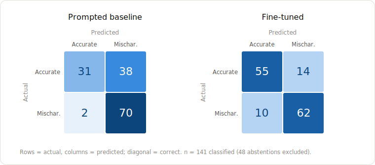

# Fine-Tuned Legal Mischaracterization Detector

This repo implements a fine-tuned version of Gemma 3 12B that exhibits improved performance at classifying accurate vs mischaracterized case law citations in real-world legal briefs.

## Headline Result

Fine-tuning Gemma 3 12B on accurate and mischaracterized legal holdings generated from the CaseHOLD dataset resulted in a ~20% improvement in macro F1 score, from 0.69 to 0.83.

  

## Problem

LLM hallucinations in legal filings are a growing problem that even the most prestigious law firms have fallen victim to (see, e.g., [Sullivan & Cromwell law firm apologizes for AI 'hallucinations' in court filing](https://www.reuters.com/legal/litigation/sullivan-cromwell-law-firm-apologizes-ai-hallucinations-court-filing-2026-04-21/)). These hallucinations manifest themselves in a few different ways. Sometimes, the LLM will cite to a case or statute that simply does not exist at all. Other times, the LLM might provide a fabricated quote from a real case. However, arguably the most pernicious category of legal hallucinations is mischaracterizations: when the LLM cites to a real legal authority, does not fabricate a quote, but cites the authority in support of a proposition or claim that the authority actually does not support. Consider the following two citations to Roe v. Wade:

1. In Roe v. Wade, 410 U.S. 113, the Supreme Court established the trimester framework for determining the extent to which states could regulate abortion.

2. The Supreme Court has held that states may not prohibit a woman's access to an abortion at any point during her pregnancy, but that they may regulate access to abortion in ways reasonably related to maternal health. Roe v. Wade, 410 U.S. 113.

The first is accurate, but the second is not fully supported by the holding in Roe. 

These types of hallucinations are especially pernicious because they can be so hard to detect. For those not intimately familiar with a cited case, determining whether the citation mischaracterizes the case's holding requires locating the court's opinion and carefully reviewing it against the citation, a process that can quickly become cumbersome and inefficient for judges charged with reviewing numerous briefs, each containing numerous citations.

## Potential Solution

Train an LLM on accurate and mischaracterized descriptions of legal holdings and use it to classify citations as either "Accurate" or "Mischaracterized". Through fine-tuning, an open-source model can be trained on domain-specific data, with the goal of improving its performance on a specific task. Here, I train Gemma 3 12B on a dataset of accurate and mischaracterized legal holdings sourced from the CaseHOLD dataset and then test whether the fine-tuned model outperforms the base model at classifying citations as "Accurate" or "Mischaracterized".

I chose Gemma 3 12B for this project because it is a high-quality open-weight model that, because it is developed by an American company (Alphabet/Google), does not present as many significant security issues as Chinese open-weight models like Qwen and DeepSeek. It is also built on Gemini technology and has both larger and smaller variants, thus presenting future opportunities to compare performance of small vs medium vs large vs frontier-sized variants within the same family of models.

## Pipeline Architecture

1. As input, take a citation to a legal case and a claim purportedly supported by the cited case.

2. Parse the citation using Eyecite.

3. Resolve the cited case using CourtListener's API.
   a. If the case cannot be resolved, abstain from classifying the claim.

4. Chunk and embed the text of the case.

5. Retrieve the top-K chunks most relevant to the claim.

6. Based on the retrieved chunks, classify the claim as "Accurate" or "Mischaracterized".

## Data

**Training/Evaluation Data:** 6,894 examples sourced from 3,447 entries from the CaseHOLD dataset. For each entry, one "Accurate" example is created using the correct holding, and one "Mischaracterized" example is created by randomly choosing one of the incorrect holdings (each CaseHOLD entry is in multiple choice format). The examples are split 85/15 between the training and evaluation sets. Each pair derived from a CaseHOLD entry is assigned to one set; pairs are never split between the training and evaluation sets.

**Retrieval Scoring:** Chunk relevance is measured using cosine similarity. build_training_data.py includes the option to specify a minimum similarity score for "Accurate" examples. If the best similarity score for a given "Accurate" example is less than the specified minimum, that CaseHOLD pair is dropped. When I built my training and evaluation datasets, I used a minimum retrieval score of 0.30, to avoid including "Accurate" examples where it was unlikely that the claim was supported by the retrieved chunks.

**Test Data:** 189 examples sourced from real-world briefs. For this, I used Damien Charlotin's database of AI hallucination cases. I filtered by US cases with at least one identified instance of misrepresented case law. From those results, I compiled 104 examples of mischaracterizations, manually verifying and annotating each one. I then reviewed the filings available in Charlotin's database and pulled 85 accurate citations from those filings (manually verifying their accuracy by reviewing each claim against the text of the cited case). The pipeline automatically dropped 48 of the test examples because it was unable to resolve the case citations via CourtListener, so the models were actually tested on 141 real-world examples: 72 "Mischaracterized" and 69 "Accurate".

**Temporal Split:** One concern is that the model may have memorized older cases during pretraining. To try to mitigate this, when building my test set I primarily focused on the most recent examples in Charlotin's database, resulting in a test set with examples that are largely from the second half of 2025 and first half of 2026 and thus less likely to be contained in model pretraining data.

## Results

The precision, recall, and F1 of each model was as follows:

| Metric | Prompted baseline | Fine-tuned |
| :--- | :---: | :---: |
| **Macro F1** | **0.69** | **0.83** |
| Accurate — precision | 0.94 | 0.85 |
| Accurate — recall | 0.45 | 0.80 |
| Accurate — F1 | 0.61 | 0.82 |
| Mischaracterized — precision | 0.65 | 0.82 |
| Mischaracterized — recall | 0.97 | 0.86 |
| Mischaracterized — F1 | 0.78 | 0.84 |

*n = 141 classified of 189 (25.4% abstention, identical for both models since it happens upstream of the classifier). Baseline = Gemma 3 12B prompted; fine-tuned = the same base model with the QLoRA adapter. Macro F1 weights both classes equally regardless of support.*

The improvement comes mainly from recall on the accurate class (0.45 → 0.80): the prompted baseline tends to default to "mischaracterized" and misses more than half the genuinely accurate citations, while fine-tuning rebalances the model without giving up much on the mischaracterized class. The below confusion matrix illustrates that:

## Limitations

1. The size of the test set is currently small. Only 189 total examples, and with the 48 abstentions, it shrinks to 141. Because of this, the results are promising but not definitive. I'd like to expand the size of the test set in the future to strengthen the result.

2. As noted above, the pipeline was unable to resolve 48 cited cases from the test dataset. In the future, those examples should be reviewed to see if anything can be done to fix these errors in resolution.

3. The fine-tuned classifier performed better overall, but it did produce more false negatives (a prediction of "Accurate" when the correct answer was "Mischaracterized") than the baseline model. Given how damaging an unidentified mischaracterization in a legal brief can be, this raises a meaningful tradeoff for lawyers to consider when choosing models: should we prefer superior overall accuracy or stronger protection against false negatives?

4. This project was limited to mischaracterizations of case law. Issues around other types of mischaracterizations, like mischaracterizations of statutes, rules, regulations, and opposing counsel's filings were not addressed.

## Tech Stack

**Language & Runtime**

- Python 3.11+

**Models & Fine-Tuning**

- Gemma 3 12B (google/gemma-3-12b-it) — base + fine-tuned classifier (27B also supported)
- Gemma 3 27B (gemma3:27b via Ollama) — prompted attribution model (used for the attribution stage but can also be used in place of 12B for base/fine-tuned classifier)
- Ollama — local model runtime serving the 27B attribution model
- PyTorch, HuggingFace Transformers
- PEFT — QLoRA / LoRA adapters
- bitsandbytes — 4-bit NF4 quantization
- TRL (SFTTrainer) — supervised fine-tuning
- Accelerate

**Compute & Serving**

- Modal — serverless H100 GPUs for both training and inference serving (MLX also supported)

**Retrieval (RAG)**

- Voyage AI voyage-law-2 — legal-domain embeddings
- NumPy — cosine-similarity retrieval
- diskcache — content-addressed caching of resolutions and embeddings (what made your re-runs cheap)

**Legal Data & Citation Tooling**

- CaseHOLD — training-data source (via HuggingFace datasets)
- CourtListener REST API v4 — case resolution and opinion text
- eyecite — legal citation parsing
- httpx — API client

**Evaluation**

- scikit-learn — classification metrics
- Custom eval harness — macro-F1, confusion matrix, abstention tracking, reproducibility manifest

**Config & Engineering**

- Pydantic — typed config with validation
- PyYAML, python-dotenv, structlog
- Ruff (lint), pytest + pytest-mock/cov, pre-commit, Hatch (build backend)

## Directory Structure

mischar-detector/
├── src/mischar/
│   ├── pipeline.py               # orchestrates the five-stage pipeline
│   ├── cli.py                    # CLI entrypoint + backend wiring
│   ├── config.py                 # typed config schema (Pydantic)
│   ├── config.example.yaml       # config template (copy to config.yaml)
│   ├── types.py                  # shared dataclasses
│   ├── constants.py              # labels, defaults, prompt versions
│   ├── cache.py                  # content-addressed disk cache (resolutions, embeddings)
│   ├── logging.py                # structlog setup
│   │
│   ├── stages/                   # the five pipeline stages, in order
│   │   ├── parse.py              #  1. parse citation (eyecite)
│   │   ├── resolve.py            #  2. resolve case + fetch opinion (CourtListener)
│   │   ├── retrieve.py           #  3. chunk, embed, top-k retrieval (Voyage)
│   │   ├── attribute.py          #  4. extract the claim (Gemma 3 27B via Ollama)
│   │   └── classify.py           #  5. accurate vs. mischaracterized (fine-tuned 12B)
│   │
│   ├── models/                   # model backend clients
│   │   ├── client.py             # ModelClient protocol + retry/JSON helpers
│   │   ├── embedding.py          # Voyage embeddings client
│   │   ├── modal_inference.py    # Modal-served adapter client
│   │   ├── ollama.py             # local Ollama backend
│   │   ├── mlx.py                # local Apple-Silicon (MLX) backend
│   │   └── gemini.py             # Gemini API backend
│   │
│   ├── prompts/                  # versioned prompt templates
│   │   ├── attribution.py
│   │   └── classification.py
│   │
│   ├── data/                     # dataset loading + splitting
│   │   ├── datasets.py           # load CaseHOLD / real-brief sets
│   │   ├── splits.py             # leakage-safe train/val split
│   │   └── annotation.py         # real-brief annotation schema
│   │
│   ├── eval/                     # evaluation harness
│   │   ├── harness.py            # run the pipeline over a dataset
│   │   ├── metrics.py            # macro-F1, P/R/F1, confusion matrix (scikit-learn)
│   │   └── report.py             # summary.md / metrics.json / reproducibility manifest
│   │
│   └── scripts/                  # runnable entrypoints
│       ├── data_construction/
│       │   └── build_casehold_set.py    # build accurate/mischaracterized pairs
│       ├── training/
│       │   ├── build_training_data.py   # resolve + retrieve + label → train/val JSONL
│       │   ├── train_secondary.py       # QLoRA fine-tune Gemma 3 12B (Modal)
│       │   └── train_primary.py         # QLoRA fine-tune Gemma 3 27B (Modal)
│       ├── inference/
│       │   └── serve_adapter.py         # Modal inference server (base + adapter)
│       └── eval/
│           └── run_eval.py              # baseline vs. fine-tuned evaluation
│
├── data/
│   └── processed/annotated/
│       └── real_briefs.jsonl     # 189-example hand-annotated held-out test set
├── assets/                       # README figures (chart, confusion matrices, diagram)
├── eval_runs/                    # timestamped eval outputs
├── docs/                         # annotation guide
├── pyproject.toml
└── README.md

config.yaml, .env, cache/, and generated data/training/*.jsonl are gitignored and created locally.

## Future Work/Improvements

- Compare fine-tuned Gemma 3 12B to Gemma 3 4B, Gemma 3 27B, and Gemini 3.1 Pro. I've already written much of the code for fine-tuning Gemma 3 27B.
- Replace Gemma 3 models with the newly-released Gemma 4 models to see whether the result still holds.
- Analyze and revise real brief test set to reduce abstention rate.
- Expand size fo real brief test set for more robust performance analysis.
  

